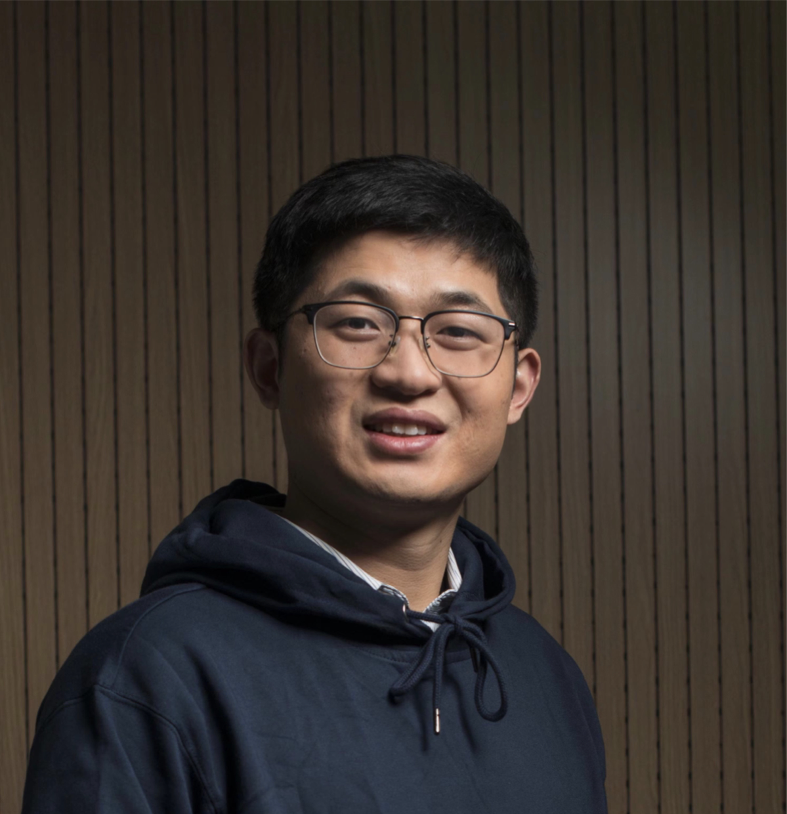

---
# Leave the homepage title empty to use the site title
title: ""

design:
  # Default section spacing
  spacing: "6rem"
---

# Chengkun Wei

 	Researcher of Hundred-Person Program (百人计划研究员)
	Department of Computer Science
 	Zhejiang University
 	Email: weichengkun AT zju DOT edu DOT cn

---
## Bio

I recieved my PhD degree in the Computer Science department of Zhejiang University in 2021 and served as a postdoctoral researcher from 2021 to 2024. My research focuses on heterogeneous computing and data security, including cloud computing, high-performance network, trusted execution environment (TEE) and LLM Security. My papers are published on top-tier conference/journal like SIGCOMM, ATC, HPCA, and also on CCS, NDSS, TIFS, and TDSC. I received the **NDSS 2024 Distinguished Paper Award** and have got fundings from the National Natural Science Foundation the Zhejiang Province Postdoctoral Funding Project. 

I hope my students:
- have interest in computer system
- have ideals and pursuits, and can analyze problems well 
- have a favorite sport and stick to it 

---
## [Publications](https://scholar.google.com/citations?hl=zh-CN&user=-jrGj9wAAAAJ)

<!--  
- Triton: A Flexible Hardware Offloading Architecture for Accelerating Apsara vSwitch in Alibaba Cloud
X Li, X Jiang, Y Yang, L Chen, Y Wang, C Wang, C Xu, Y Lv, B Yang, ...
Proceedings of the ACM SIGCOMM 2024 Conference, 750-763		2024
  -->
<!--  
- CMDRL: A Markovian Distributed Rate Limiting Algorithm in Cloud Networks
  

  L Chen, X Jiang, X Hu, T Xu, Y Yang, X Li, B Lu,<b> C Wei</b>, W Chen

  Proceedings of the 8th Asia-Pacific Workshop on Networking, 59-66		2024
  
 -->
 
- HydraRPC:RPC in the CXL Era
  

  T Ma, Z Liu, <b>C Wei</b>, J Huang, Y Zhuo, H Li, N Zhang, Y Guan, D Niu, ...

  2024 USENIX Annual Technical Conference (USENIX ATC 24), 387-395		
  

 
- Securely sampling discrete Gaussian noise for multi-party differential privacy
  

  <b>C Wei</b>, R Yu, Y Fan, W Chen, T Wang

  Proceedings of the 2023 ACM SIGSAC Conference on Computer and Communications Security		
   

 
- Dpmlbench: Holistic evaluation of differentially private machine learning
  

  <b>C Wei</b>, M Zhao, Z Zhang, M Chen, W Meng, B Liu, Y Fan, W Chen

  Proceedings of the 2023 ACM SIGSAC Conference on Computer and Communications Security	
   

   
- Examining the effects of a real-time, knowledge-aware tool for academic writing assessment
  

  X Li, F Ouyang, J Liu, <b>C Wei</b>, W Chen

  Journal of Educational Computing Research 61 (6), 1143-1174	
   
- Achelous: Enabling Programmability, Elasticity, and Reliability in Hyperscale Cloud Networks
  

  <b>C Wei</b>, X Li, Y Yang, X Jiang, T Xu, B Yang, T Wu, C Xu, Y Lv, H Gao, ...

  Proceedings of the ACM SIGCOMM 2023 Conference, 769-782	
   

<!--  
- Poster: Triton: Accelerating vSwitch with Flexibility through Hardware Assisting not Bypassing Software
  

  X Li, X Jiang, Y Yang, L Chen, T Xu, C Xu, L Xiao, F Shi, Y Wang, T Wu, ...

  Proceedings of the ACM SIGCOMM 2023 Conference, 1156-1158	
   

    -->
- Lmsanitator: Defending prompt-tuning against task-agnostic backdoors
  

  <b>C Wei</b>, W Meng, Z Zhang, M Chen, M Zhao, W Fang, L Wang, Z Zhang, ...

  arXiv preprint arXiv:2308.13904	
   

 
- EduNER: a Chinese named entity recognition dataset for education research
  

  X Li, <b>C Wei</b>, Z Jiang, W Meng, F Ouyang, Z Zhang, W Chen

  Neural Computing and Applications 35 (24), 17717-17731	
   

<!--    
- Hyq: Hybrid i/o queue architecture for nvme over fabrics to enable high-performance hardware offloading
  

  Y Chen, J Chen, Y Wang, Y Chen, Z Jin, J Xu, G Fang, W Lin, <b>C Wei</b>, ...

  2023 IEEE/ACM 23rd International Symposium on Cluster, Cloud and Internet Computing	
   

 
- High-performance and Scalable Software-based NVMe Virtualization Mechanism with I/O Queues Passthrough
  

  Y Chen, Z Jin, Y Wang, Y Chen, H Yu, J Xu, J Chen, W Lin, K Fang, <b>C Wei</b>, ...

  arXiv preprint arXiv:2304.05148	
   
 -->

- BM-Store: A Transparent and High-performance Local Storage Architecture for Bare-metal Clouds Enabling Large-scale Deployment
  

  Y Chen, J Xu, <b>C Wei</b>, Y Wang, X Yuan, Y Zhang, X Yu, Y Chen, Z Wang, ...

  2023 IEEE International Symposium on High-Performance Computer Architecture	
  

- Cuzk: Accelerating zero-knowledge proof with a faster parallel multi-scalar multiplication algorithm on gpus
    

    T Lu, <b>C Wei</b>, R Yu, C Chen, W Fang, L Wang, Z Wang, W Chen

    Cryptology ePrint Archive		
    

 
- AsgLDP: Collecting and generating decentralized attributed graphs with local differential privacy
  

  <b>C Wei</b>, S Ji, C Liu, W Chen, T Wang

  IEEE Transactions on Information Forensics and Security 15, 3239-3254	  
   

 
- OB-WSPES: A uniform evaluation system for obfuscation-based web search privacy
  

  <b>C Wei</b>, Q Gu, S Ji, W Chen, Z Wang, R Beyah

  IEEE Transactions on Dependable and Secure Computing 18 (6), 2719-2735
  

 